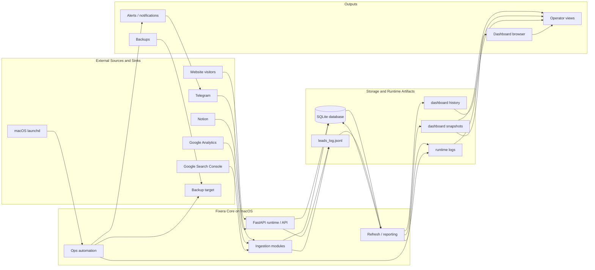

# Architecture Diagram v1

This is a sanitized public view of the private production architecture behind `fixera-core`.
It shows the verified runtime shape without exposing real paths, domains, credentials, customer data, or operational incidents.

Notes:
- The diagram is intentionally compact and single-page.
- It represents the private production architecture in sanitized form.
